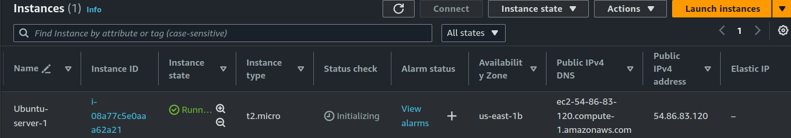
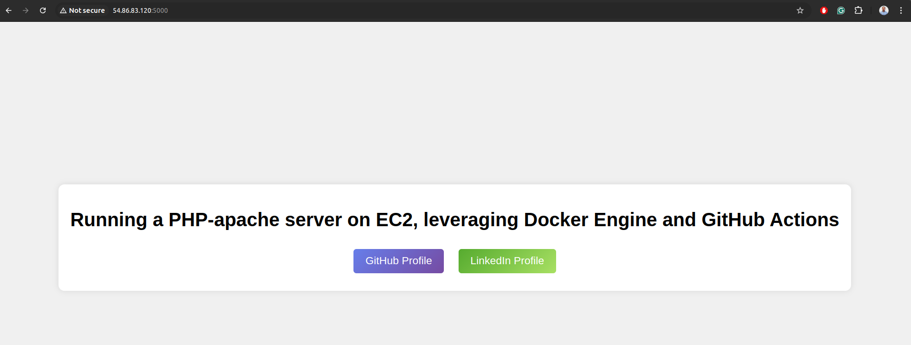

# CI & CD Pipeline Setup using GitHub Actions

Deployed an `index.html` application leveraging Docker Engine running PHP Apache on an AWS EC2 instance using GitHub Actions for automation.

## Project Overview

This project sets up a continuous integration and continuous delivery (CI/CD) pipeline to deploy a simple `index.html` web application on an EC2 instance using Docker. The app runs on a containerized PHP Apache server.

## Steps to Set Up

1. **Create Files**:
    ```bash
    $ touch index.html Dockerfile docker-compose.yml
    ```

2. **Launch EC2 Instance**:
    - Create an AWS EC2 instance.
    - Set inbound rules for custom TCP on port 5000.

    

3. **Set Up Private SSH Key for GitHub**:
    - Generate an SSH key and add the private key to GitHub Secrets.

4. **Add GitHub Secrets**:
    Go to your GitHub repository and add the following secrets:
    - `EC2_SSH_KEY`: Your private SSH key.
    - `HOST_DNS`: Public IP or DNS of your EC2 instance.
    - `USERNAME`: Username for the EC2 instance (e.g., `ubuntu`).

5. **Challenges**:
    - Public IP changes on AWS Free-tier instances, so you'll need to update the `HOST_DNS` GitHub secret each time the EC2 instance is restarted.

    

## Docker Configuration

### Dockerfile:
```dockerfile
FROM php:7.4-apache

COPY . /var/www/html

EXPOSE 80
