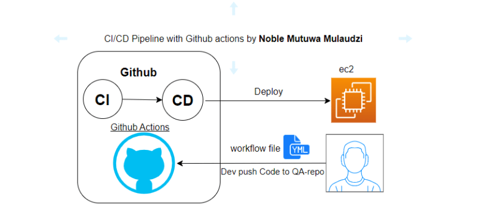
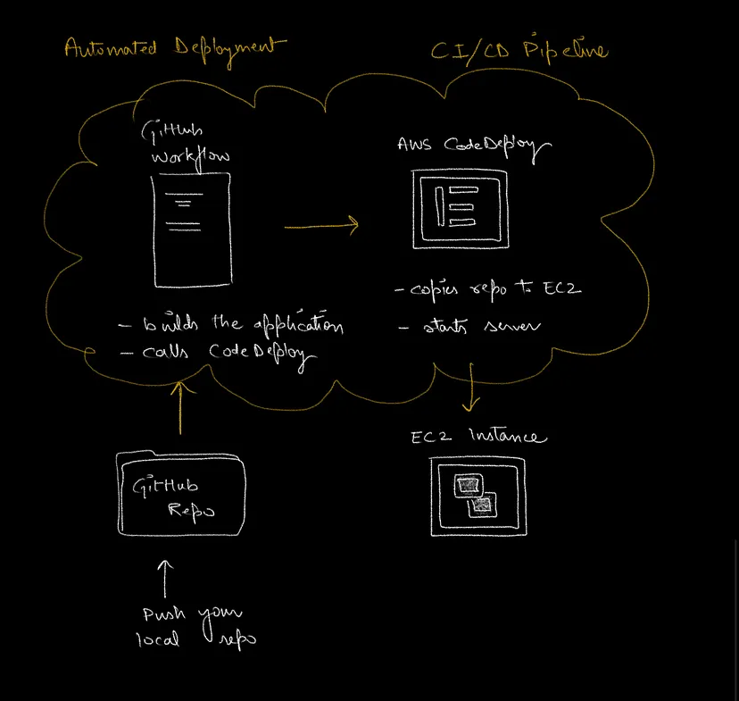

*** Local to GitHub ***
*** GitHub to EC2 ***

xflow@wajahat:Assignment_3$ touch index.html

xflow@wajahat:Assignment_3$ touch Dockerfile docker-compose.yml

Launch an EC2 instance

setup a private ssh key for Github

go to github & add secrets

https://docs.github.com/en/actions/creating-actions/creating-a-docker-container-action