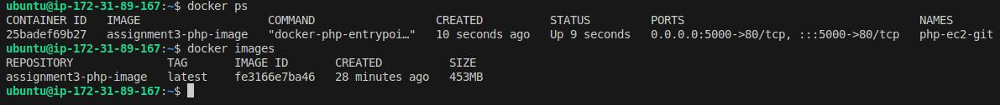
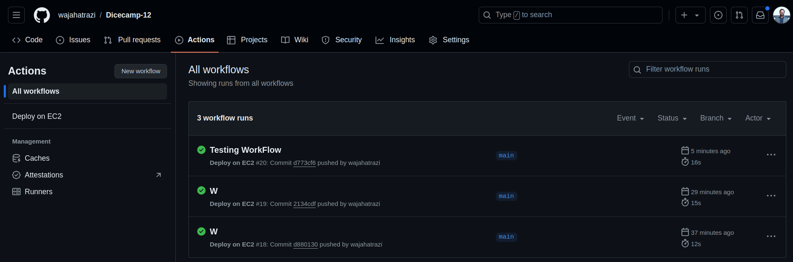
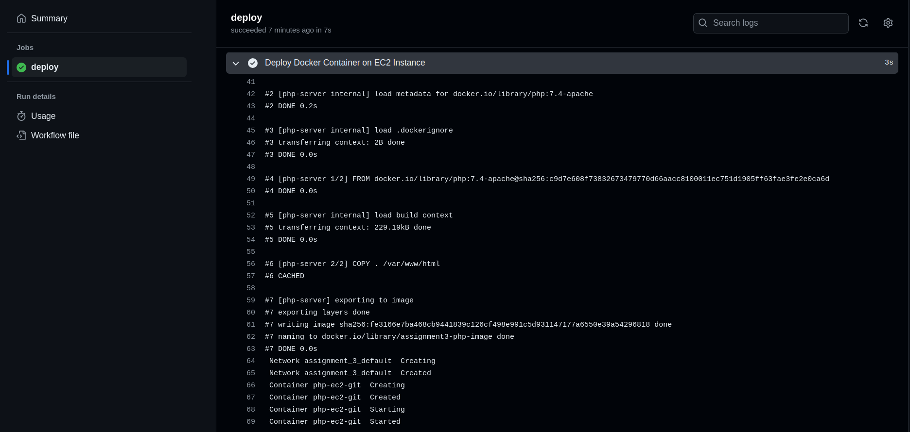

## Successful Setup of CI & CD Pipeline using GitHub Actions. 

Deployed an index.html application leveraging Docker Engine running PHP Apache. 

xflow@wajahat:Assignment_3$ touch index.html

xflow@wajahat:Assignment_3$ touch Dockerfile docker-compose.yml

Launch an EC2 instance

setup a private ssh key for Github

Set inbound rules having custom tcp 5000

go to github & add secrets

Challanges:
- Using Free-tier, the public IP changes, for which you will have to update the GitHub secrets. 

https://docs.github.com/en/actions/creating-actions/creating-a-docker-container-action

